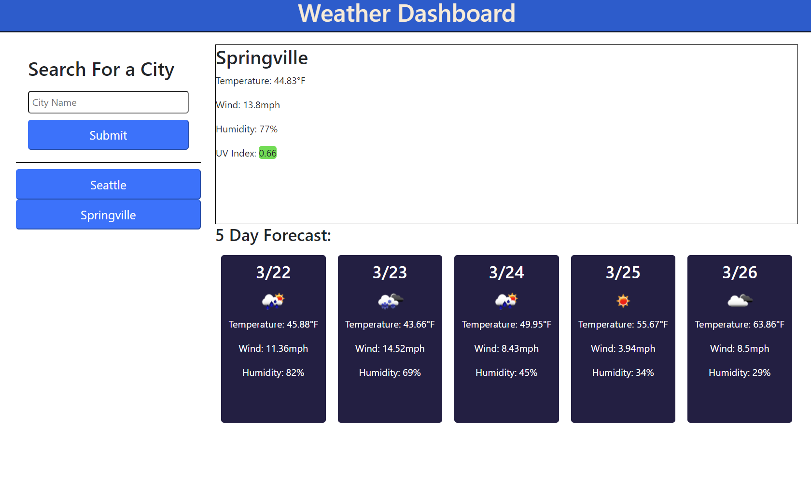

# Weather-Dashboard

# <Weather-Dashboard>

## Description

Travelers would like to be able to know the weather conditions in the places that they are travelling to. I created a website that allows them to type in the name of any city and get the current weather, including helpful information like wind speed and temperature. It also includes the forecast for the next 5 days, displayed simply and in a line for ease of reading. The 5 day forecast includes an icon showing the weather for easy skimming of the information.

## Usage

Visit the finished product here: https://tessshearer.github.io/Weather-Dashboard/

